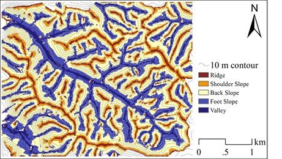
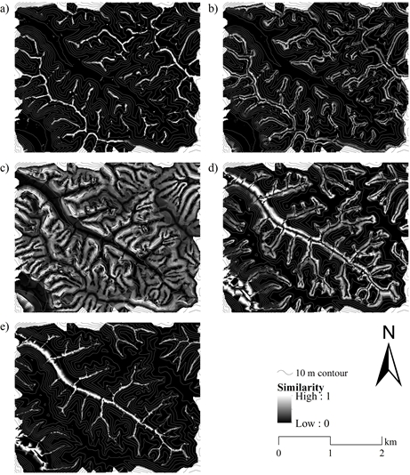

# Welcome to AutoFuzSlpPos
----------
AutoFuzSlpPos (short for "**Automated Extraction of Fuzzy Slope Position**") is developed by PhD candidate Liangjun Zhu and **Prof.** Chengzhi Qin.

+ Manual in [Chinese](README_CN.md).
+ [ChangeLog](ChangeLog.md) Information

Contact and support email: zlj@lreis.ac.cn

AutoFuzSlpPos is designed to extract fuzzy slope position information in hillslope scale based on the method proposed by Qin et al.(2009) and Qin et al.(2012).

~~~
References:
Qin, C.Z., Zhu, A.X., Shi, X., Li, B.L., Pei, T., Zhou, C.H., 2009. Quantification of spatial gradation of slope positions. Geomorphology 110, 152-161.
Qin, C.-Z., Zhu, A.-X., Qiu, W.-L., Lu, Y.-J., Li, B.-L., Pei, T., 2012. Mapping soil organic matter in small low-relief catchments using fuzzy slope position information. Geoderma 171, 64-74.
~~~

AutoFuzSlpPos is based on [TauDEM](http://hydrology.usu.edu/taudem/taudem5/index.html) parallelized framework and submitted to TauDEM LICENSE.

Several functions of TauDEM are used to accomplish the preprocessing from DEM, include `Pitremove`, `D8FlowDir`, `DinfFlowDir`, `AreaD8`, `Threshold`, `MoveOutletsToStreams`, `AreaDinf`, `DinfDistDown`.

Also, some functions revised from TauDEM are developed, include `D8DistDownToStream`, `D8DistUpToRidge`, `DinfDistUpToRidge`.

Besides, new functions are designed, include `Curvature`, `SelectTypLocSlpPos`, `FuzzySlpPosInference` and `HardenSlpPos`.

AutoFuzSlpPos is programmed using C++ and Python. It can be compiled by Microsoft Visual Studio on Windows and GCC 4.7+ compiler on Linux/Unix. 

We have tested on Windows 7, CentOS 6.2 and Ubuntu 14.04. 
## INSTALLATION
------
### **1. Compile with CMAKE and nmake (Visual Studio) on Windows Platform**

  + Check the MPI Library path in CMakeLists.txt to make sure they are correct for your environment.
~~~
i.e.
include_directories("C:/Program Files/Microsoft HPC Pack 2012/Inc")
link_directories("C:/Program Files/Microsoft HPC Pack 2012/Lib/i386")
link_libraries("C:/Program Files/Microsoft HPC Pack 2012/Lib/i386/msmpi.lib")
~~~
  + From Start menu, run "Visual Studio Command Prompt (2010)" as administrator.
~~~
cd <Destination_Build_Path>
cmake <Source_Path>
i.e. 
cd C:\AutoFuzSlpPos\build
cmake C:\AutoFuzSlpPos\src
~~~
  This will this will generate Visual Studio Project. Then you can edit or compile through VS.
  + As an alternative selection, We recommend this method to compile executable files directly.
~~~
cmake -G "NMake Makefiles" <Source_Path>
nmake
~~~

### **2. Compile with makefile on Linux/Unix Platform**
+ compile [MPICH](http://www.mpich.org/downloads/)
+ Check the MPI_DIR in makefile to make sure it is correct for you.
~~~
i.e.
MPI_DIR = /home/zhulj/mpich/
~~~
+ Then, type this
~~~
cd <Soource_Path/src>
make
~~~
+ By default, the executable file will be located in `../exec_linux_x86`. You can change `INSTALLDIR` to control it.
~~~
i.e.
INSTALLDIR=../exec_linux_x86
~~~
	

## Configuration
--------
TO BE CONTINUE

Now, you are ready to run the program through 
~~~
py_main/AutoFuzSlpPos_main.py
~~~
## Run AutoFuzSlpPos
--------
TO BE CONTINUE

## Case Study
------

**Fig.1 HardenMap of Study Area**

**Fig.2 Maximum Similarity to Slope Position**

**Fig.3 Similarity to Each Slope Position**

