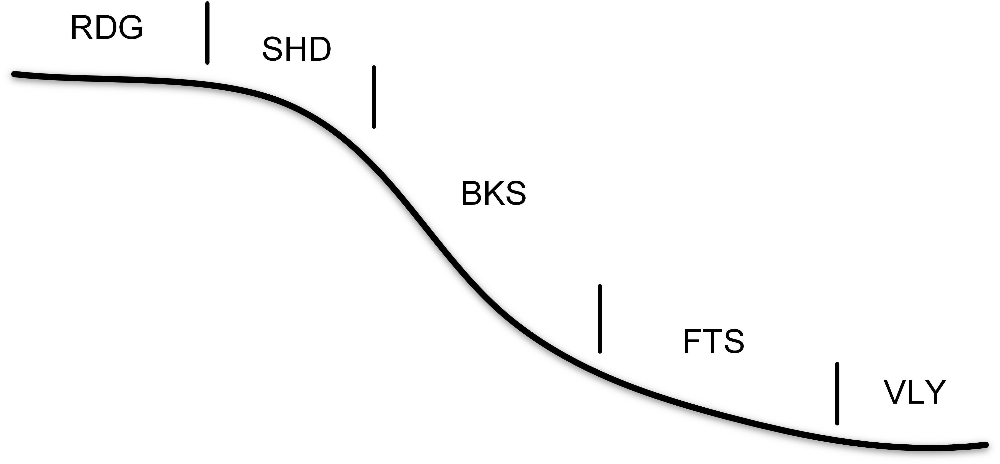

# Welcome to AutoFuzSlpPos
----------
AutoFuzSlpPos (short for "**Automated for Fuzzy Slope Position**") is developed by PhD candidate Liang-Jun Zhu and **Prof.** Cheng-Zhi Qin in Lreis, IGSNRR, CAS, China.

+ also see [User Manual in Chinese](README_CN.md).

Contact and support email: zlj@lreis.ac.cn
Update date: 2016-1-29

1. [Introduction](#1-introduction)
2. [Installation](#2-installation)	
	- [Code structure](#21-code-structure)
	- [Installation on Windows](#22-installation-on-windows)
	- [Installation on Linux/Unix](#23-installation-on-linuxunix)
	- [Configuration](#24-configuration) 
3. [Run AutoFuzSlpPos](#3-run-autofuzslppos)

# 1 Introduction

AutoFuzSlpPos is an automatic approach with only one required input data (i.e., a gridded DEM of the study area) to deriving fuzzy slope positions based on the prototype-based method proposed by Qin *et al*. (2009. Quantification of spatial gradation of slope positions. Geomorphology 110, 152-161.). 

The prototype-based method consists three major steps, i.e., preparing topographic attributes, extracting typical locations, and calculating similarity for each slope position.

The preliminary implementation employs the system of five basic slope positions, such as Fig.1.

**Fig.1 Schematic of the five slope positions**

AutoFuzSlpPos V1.0 is developed under the [TauDEM parallelized framework](http://hydrology.usu.edu/taudem/taudem5/index.html "TauDEM") and programmed using C++ and Python language. 

The program is capable with Windows and Linux/Unix, e.g., Windows 7/8/10, CentOS 6.2, and Ubuntu 14.04. The  prerequisites environment of the compilation  and configuration of AutoFuzSlpPos is as follows:

- For PC, [Microsoft Visual C++ Redistributable](https://www.microsoft.com/en-us/download/details.aspx?id=14632) (e.g., VS 2010), [Microsoft HPC Pack 2012 MS-MPI Redistributable Package](https://www.microsoft.com/en-US/download/details.aspx?id=14737), CMAKE
- For Linux/Unix, GCC 4.7+, MAKE, and MPICH or OpenMPI
- Python 2.7+ packaged with Numpy 1.6+ and GDAL 1.9+.

# 2 Installation

If you want to install from source code, please follow [Installation on Windows](2.2 Installation on Windows) or [Installation on Linux/Unix](2.3 Installation on Linux/Unix). If you want to use AutoFuzSlpPos directly with the compiled executable files, please refers to [Configuration](2.4 Configuration).

## 2.1 Code structure
The source code consists of two parts: 1) the C++ source code located in `../<source-code>/src`, and 2) python scripts located in `../source-code/src`. 

C++ code will be compiled as separated executable files, such as "**SelectTypLocSlpPos**" which is used for extracting typical locations and setting parameters for fuzzy inference of each slope position.
 
Python script is to organize the whole work-flow with a configurable script for users’ customizing optional parameters, such as follows.

| Script | Functionality |
|--------|---------------|
| `main.py`| The entrance of AutoFuzSlpPos |
| `Config.py` | The configuration file for user customization |
| `Nomenclature.py` | Predefined filenames |
| `TauDEM.py` | Functions  based  on  TauDEM  and  the  extension  functions,  e.g., SelectTypLocSlpPos |
| `Util.py` | Some fundamental functions, e.g., functions for the Input/Output of raster data |
| `PreProcessing.py` | Preprocessing  for  topographic  attributes,  such  as  relative  position index (RPI), profile curvature |
| `SelectTypLoc.py` | Prepare input files for typical location extraction |
| `FuzzySlpPosInference.py` | Prepare input files for fuzzy inference of each slope position |

## 2.2 Installation on Windows

The MPI library used for PC is [Microsoft HPC Pack 2012 MS-MPI Redistributable Package](https://technet.microsoft.com/en-us/library/cc514029.aspx "MS-MPI"). Please make sure that CMAKE and nmake (installed with Visual Studio, such as VS2010) have been installed on your PC. It is highly recommended to check the MPI Library path in `../<source-code>/src/CMakeLists.txt` to make sure they are correct for user’s environment:

~~~
include_directories("C:/Program Files/Microsoft HPC Pack 2012/Inc")
link_directories("C:/Program Files/Microsoft HPC Pack 2012/Lib/i386")
link_libraries("C:/Program Files/Microsoft HPC Pack 2012/Lib/i386/msmpi.lib")
~~~
Then, open “Visual Studio Command Prompt” from Start menu (as administrator), and run the following commands:

~~~
cd <Build_Path>
cmake -G "NMake Makefiles" <Source_Path>
nmake

e.g.,
cd C:\AutoFuzSlpPos\build
cmake -G "NMake Makefiles" C:\source-code\src
nmake
~~~

The executable files will be compiled and saved in `<Build_Path>`.

## 2.3 Installation on Linux/Unix

Unlike the MPI version for PC, the implementation of [MPICH](http://www.mpich.org/downloads/ "MPICH") is adopted for Linux/Unix platform.

Firstly, check the MPI Library path in `../<source-code>/src/makefile` to make sure that it is correct for your environment:
~~~
MPI_DIR = /home/zhulj/mpich/
~~~
Then, assign the installation path:
~~~
INSTALLDIR=/home/zhulj/AutoFuzSlpPos/exec_linux
~~~

Lastly, run the following commands:
~~~
cd <Source_Path/src>
make
~~~ 
The executable files will be generated in `INSTALLDIR`.
## 2.4 Configuration

A script program of Python language is implemented to organize the work-flow of deriving fuzzy slope positions.
You can configure the environment of AutoFuzSlpPos through the configuration file `../source-code/py_main/Config.py`. The path of the executable files must be set as follows:
~~~
mpiexeDir = r'/home/zhulj/mpich/bin' or None
exeDir = r'/home/zhulj/AutoFuzSlpPos/exec_linux'
hostfile = r'/home/zhulj/AutoFuzSlpPos/exec_linux/dgpm' or None
~~~
Note that, if the path of MPI is ENVIRONMENT PATH in your system, the mpiexeDir could be set as `None`. The `hostfile` is used to specify the hosts on which the MPI jobs will be run. If you does not know how to prepare the `hostfile`, just leave it as `hostfile = None`.

After that, you can run AutoFuzSlpPos program for a specific study area.

# 3 Run AutoFuzSlpPos

The only required data is the digital elevation model (DEM) of the study area. The first step of running AutoFuzSlpPos program is to assign your DEM path to `rawdem`. Then, the workspace `rootDir` needs to be set.

Other parameters can be left as default. These optional parameters are briefly introduced in the configuration script `../<source-code>/py_main/Config.py`.

The following command is used to run AutoFuzSlpPos:
~~~
python ../<source-code>/py_main/main.py
~~~

The following table gives a brief introduction to the result files.

| Result Folder | Introduction |
|---|---|
| FuzzySlpPos | Similarity maps of each slope position, as well as the hardened map of slope positions and the corresponding maximum similarity map |
| DinfpreDir | Intermediate files in preparing topographic attributes |
| Params | GRID  of  topographic  attributes,  including  RPI  (Relative  Position  Index), profile curvature, slope gradient, and HAND (Height Above the Nearest Drainage), by default. |
| Config | Configuration files of the extraction of typical locations and fuzzy inference for each slope positions |
| TypLoc | Typical locations of each slope positions |
| Log | Log files which record information such as runtime, etc. |

Note that in the current implementation a system of five basic slope positions is used, i.e., ridge(RDG), shoulder slope (SHD), backslope (BKS), footslope (FTS), and valley (VLY).
